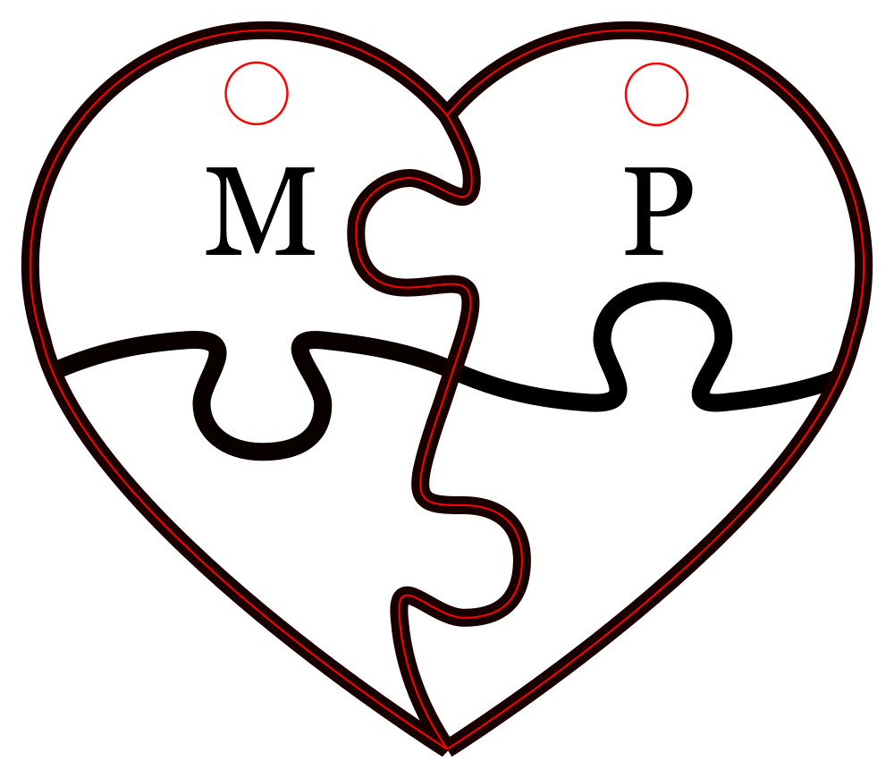

# Puzzle heart keychain

## About
Laser cut wooden keychain made with [Inkscape](https://inkscape.org/), a 3mm [MDF](https://en.wikipedia.org/wiki/Medium-density_fibreboard) board, and a [Epilog Mini 24 Laser](https://www.epiloglaser.com/laser-machines/legend-laser-series.htm) machine.

## How-to
Print `puzzle_heart_keychain.svg` or `puzzle_heart_keychain.pdf` with :
- red color : laser cutting
- black color : laser engraving

## Preview

## License
Puzzle heart keychain is released under the [GNU General Public License v3.0](https://www.gnu.org/licenses/gpl-3.0.fr.html).